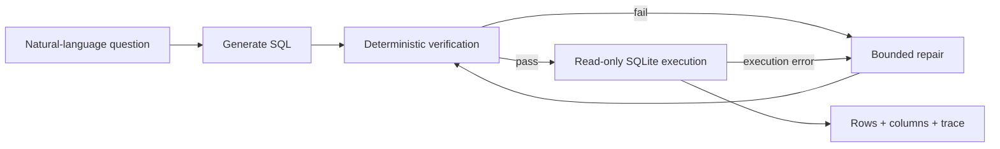

# Semantic Text-to-SQL

**A local Text-to-SQL system that makes the reliability layer visible: generate SQL, verify it deterministically, repair bounded failures, then execute read-only.**

The project is built around a simple question: an LLM can produce SQL, but can the surrounding system make failures safer and measurable?

## Demo

On Windows:

```cmd
run-demo.cmd
```

The one-click launcher opens the Streamlit showcase. It puts the full flow on one screen:

```text
Question
  ↓
Generate SQL
  ↓
Verify ✓ ── failure ──→ Repair (max 2)
  ↓                         │
Execute read-only ←─────────┘
  ↓
Result table
```

Try:

```text
How many orders were placed in 2024?
```

The built-in offline provider intentionally exercises the same service boundaries and can demonstrate a repair path without Ollama. It is a **product demo only**; benchmark claims below come from the frozen local-model run.

## Key result

Frozen paired evaluation on **100 BIRD DEV queries** using local `qwen3.5:4b` through Ollama:

| Metric | Direct | Guarded + repair |
|---|---:|---:|
| Execution success | 63% | **82%** |
| Official BIRD EX | 31% | **34%** |
| Median latency | **28.1 s** | 46.7 s |

The guarded workflow recovered **19 direct execution failures**. The trade-off is visible too: higher execution reliability costs latency and does not guarantee semantic correctness.

Source of truth: [`runs/bird-paired-dev-v4/paired.json`](runs/bird-paired-dev-v4/paired.json).

## Architecture



The reliability layer is deliberately small: deterministic checks, read-only execution, structured failure states, and at most two repair attempts.

## What the demo shows

- the natural-language question
- generated SQL
- verification status
- number of SQL attempts
- final rows and columns
- pipeline activity for generate / verify / repair / execute
- offline demo or real local Ollama provider from the same UI

## Engineering highlights

- **Deterministic verification before execution.** Obvious unsafe or invalid candidates are rejected without asking another model to judge them.
- **Read-only execution.** Generated SQL runs through a constrained SQLite execution path.
- **Bounded repair.** `max_repairs=2` prevents an open-ended agent loop.
- **Shared service layer.** Streamlit, FastAPI, and CLI all sit on the same `SemanticSQLService` behavior.
- **Paired evaluation.** Direct and guarded paths are compared on the same frozen BIRD cases.
- **Honest metrics.** Execution success and official BIRD EX are reported separately.

## Quickstart

Offline visual demo:

```bash
uv sync
uv run streamlit run app.py
```

For the real local-model path, pull the model and select **Ollama** in the sidebar:

```bash
ollama pull qwen3.5:4b
uv run streamlit run app.py
```

CLI:

```bash
uv run semantic-sql ask "Which customer spent the most?"
```

FastAPI:

```bash
uv run uvicorn semantic_sql.api:app --reload
```

## Why execution success is not correctness

These metrics answer different questions:

- **Execution success** — did the final SQL run successfully against SQLite?
- **Official BIRD EX** — did the executed result match the benchmark answer under the official evaluator?

A query can execute cleanly and still answer the wrong question. That is why the 82% execution-success figure is not presented as 82% Text-to-SQL accuracy.

## Stack

Python · FastAPI · Streamlit · LangGraph · SQLite · Qwen3.5 4B / Ollama · pytest

## Limits

- The evaluation is a frozen 100-query BIRD DEV sample, not the full benchmark.
- Execution success is not semantic correctness.
- The current workflow targets SQLite rather than arbitrary production databases.
- Results depend on the frozen local-model configuration.
- The offline provider exists to demo the product path and is not evaluation evidence.
