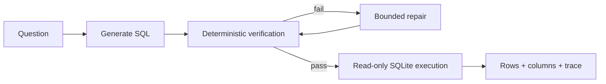

<h1 align="center">Semantic Text-to-SQL</h1>

<p align="center">
  <strong>Local NL → SQL with schema grounding, deterministic verification, bounded repair, and read-only execution.</strong>
</p>

<p align="center">
  
  
  
  
  
</p>

<p align="center">
  <a href="#demo">Demo</a> ·
  <a href="#measured-result">Measured result</a> ·
  <a href="#semantic-revision-ablation">Semantic ablation</a> ·
  <a href="#architecture">Architecture</a>
</p>

## At a glance

| | |
|---|---|
| **Problem** | A generated SQL query can be safe, valid, and executable while still answering the wrong question. |
| **What I built** | A local Text-to-SQL pipeline with schema grounding, deterministic preflight, bounded repair, read-only execution, and explicit failure traces. |
| **Measured result** | On a frozen 100-query BIRD DEV slice with `qwen3.5:9b-q4_K_M`, guarded verification + repair improved BIRD EX from **33% → 39%** and conservative execution success from **75% → 90%**. |
| **Design focus** | Improve reliability with bounded, inspectable checks instead of adding open-ended agent loops. |

> [!NOTE]
> The core lesson behind this project is simple: **executable SQL is not necessarily correct SQL**.

## Demo

```cmd
run-demo.cmd
```

The Streamlit demo puts the question, generated SQL, verification trace, execution result, and table output on one screen. The default **Demo (offline)** provider needs no Ollama or API key.

<p align="center">
  
</p>

> The image above is an illustrated preview of the existing Streamlit UI, not a benchmark screenshot.

```text
Question
  ↓
Generate SQL
  ↓
Verify ── failure ──→ Repair (bounded)
  ↓ pass                  │
Execute read-only ←───────┘
  ↓
Rows + trace
```

Try:

```text
How many orders were placed in 2024?
```

The built-in offline provider demonstrates the service flow only; benchmark claims below come from frozen local-model runs.

## Measured result

Frozen paired evaluation on **100 BIRD DEV queries** using local `qwen3.5:9b-q4_K_M` through Ollama:

| Metric | Direct | Guarded + repair |
|---|---:|---:|
| BIRD EX | 33% | **39%** |
| Execution success | 75% | **90% (conservative)** |
| EX wrong → correct | — | **6** |
| EX correct → wrong | — | **0** |

The guarded path recovered **6 correctness failures** with no correct-to-wrong EX regressions, and conservatively recovered **15 direct execution failures**. The raw guarded execution-success count was 91/100, but one capped result invalidated that row for strict comparison, so the resume-facing figure is 90/100.

Source of truth: [`runs/qwen9b-frozen100/summary.json`](runs/qwen9b-frozen100/summary.json). The repository's local BIRD EX scorer follows the set-of-result-rows semantics of the BIRD evaluator pinned at revision `483554eae102996f5ec1f4feab4e78ef29c2a394`; it is not a direct invocation of upstream evaluator code.

> [!IMPORTANT]
> Provenance workflow run `37307108955` is **not a clean successful workflow run**. All cases in the failing 25-case shard finished, but strict validity marked that shard invalid and the job exited non-zero. The checked-in summary therefore reports the conservative 90/100 guarded execution figure explicitly instead of presenting the workflow status as a clean pass.

## Semantic revision ablation

A later frozen-100 experiment tested a conservative one-pass semantic reviewer on top of the same Qwen 9B guarded outputs. The reviewer checked projection, aggregation/grain, joins, filters/literals, and ordering/top-k semantics, then re-verified any patch before execution.

| Frozen-100 | Guarded baseline | + Semantic revision |
|---|---:|---:|
| BIRD EX | **39%** | 38% |
| Conservative execution success | **90%** | **90%** |
| Wrong → correct | — | 0 |
| Correct → wrong | — | 1 |

The semantic layer produced **no positive EX rescue and one regression**, so it is kept as an experiment rather than part of the headline/default path. This is the main reason the project stays with the simpler guarded pipeline.

### Separate XiYan grounding ablation

A separate frozen-100 experiment tested **Decomposed Grounded Schema Linking (DGSL v1)** with XiYanSQL 7B and a project-local set-equality execution scorer. This is a **different model and scorer** from the Qwen3.5 / BIRD-EX table above, so the numbers are not directly interchangeable.

| XiYan frozen-100 | Lexical baseline | DGSL v1 |
|---|---:|---:|
| Frozen execution match | **58/100** | **58/100** |
| Wrong → correct | — | 7 |
| Correct → wrong | — | 7 |
| Success gate | — | 61/100 |
| Gate met | — | **No** |

DGSL improved schema-context precision and observable value grounding, but the gains were offset by regressions and produced **no net correctness gain**. See [the DGSL experiment note](docs/dgsl-experiment.md) and [the compact frozen result](runs/xiyan-dgsl-frozen100/summary.json).

## Two failures worth inspecting

The aggregate numbers hide the most important engineering lesson: **a query becoming executable is not the same thing as becoming correct**.

### 1. Repair can recover execution without recovering meaning

**BIRD case 430 · `card_games`**

The direct query referenced a nonexistent `cardKingdoms` table and failed to execute. The guarded path caught the compile failure, repaired the SQL once, passed verification, and executed successfully — but the final query still failed BIRD EX.

```text
Direct
  → execution failed: no such table: cardKingdoms

Guarded
  → verify: sqlite_compile_error
  → repair attempt 1
  → verify: PASS
  → execute: rows=0
  → BIRD EX: false
```

**Takeaway:** bounded repair is useful for operational reliability, but a successful execution is not evidence that the model understood the question.

### 2. Some wrong answers look completely healthy

**BIRD case 1366 · `student_club`**

For “List all the members who attended the event `October Meeting`,” the generated SQL passed deterministic verification and returned 23 rows. Both direct and guarded paths executed successfully, yet BIRD EX was false.

```text
verify: PASS
execute: rows=23
status: OK
BIRD EX: false
```

**Takeaway:** deterministic checks can reject unsafe or invalid SQL; they cannot prove semantic correctness.

These two examples come from an earlier frozen 4B run and illustrate the same failure distinction; they are not part of the 9B headline table.

## Architecture



An optional semantic-review path remains available for experimentation, but the frozen ablation above did not justify enabling it by default.

## Engineering choices

- **Deterministic checks before execution** instead of asking another model to judge obvious compiler or safety failures.
- **Bounded repair** with `max_repairs=2`, avoiding an open-ended agent loop.
- **Read-only SQLite execution** so generated SQL cannot mutate the database.
- **Schema grounding by default** keeps generation tied to the actual database surface; richer value-grounding ideas remain experimental because the frozen DGSL ablation showed no net correctness gain.
- **One service layer** behind Streamlit, FastAPI, and CLI.
- **Paired evaluation** keeps reliability and correctness claims tied to the same frozen cases.
- **Ablation before adoption**: semantic planning/revision ideas are kept only when they show positive net evidence.

## Quickstart

### Offline visual demo

```bash
uv sync
uv run streamlit run app.py
```

The default offline mode uses the bundled SQLite demo database and requires no model download or API key.

### Local-model path

```bash
ollama pull qwen3.5:4b
uv run streamlit run app.py
```

Choose **Ollama** in the sidebar.

### Optional semantic revision in Python

```python
service = SemanticSQLService(
    "my.db",
    provider=provider,
    semantic_revision=True,
)
```

### CLI

```bash
uv run semantic-sql ask "Which customer spent the most?"
```

### FastAPI

```bash
uv run uvicorn semantic_sql.api:app --reload
```

## Evaluation note

> [!IMPORTANT]
> **Execution success is not Text-to-SQL accuracy.** A query can execute successfully and still answer the wrong question. The 90% figure represents conservative execution reliability, while BIRD EX is the correctness-oriented metric. The semantic-revision ablation did not improve EX, so the simpler guarded path remains the headline result.

## Limits

- Frozen headline evaluation is a 100-query BIRD DEV sample, not the full benchmark.
- SQLite only in the current implementation.
- Results depend on the frozen local-model configuration.
- The optional semantic revision adds one extra model call when enabled and did not improve the frozen-100 EX result.
- The Qwen 9B provenance workflow contains a strict-validity shard failure; the checked-in summary records the conservative reporting decision.
- The offline provider is demo infrastructure, not evaluation evidence.
