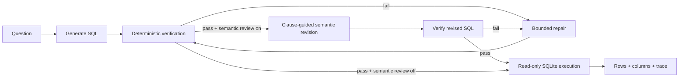

<h1 align="center">Semantic Text-to-SQL</h1>

<p align="center">
  <strong>Local NL → SQL with clause-guided semantic revision, deterministic verification, bounded repair, and read-only execution.</strong>
</p>

<p align="center">
  
  
  
  
  
</p>

<p align="center">
  <a href="#demo">Demo</a> ·
  <a href="#semantic-revision">Semantic revision</a> ·
  <a href="#measured-result">Measured result</a> ·
  <a href="#architecture">Architecture</a>
</p>

## At a glance

| | |
|---|---|
| **Problem** | A generated SQL query can be safe, valid, and executable while still answering the wrong question. |
| **What I built** | A local Text-to-SQL pipeline that separates **semantic review** from **operational reliability**: one-pass clause-guided revision, deterministic preflight, bounded repair, and read-only execution. |
| **Measured baseline** | On a frozen 100-query BIRD DEV run with `qwen3.5:4b`, deterministic guarding raised execution success from **63% → 82%**, while official EX moved **31% → 34%**. |
| **Design focus** | Make failure modes visible: semantic mistakes, invalid SQL, repair attempts, and execution are treated as different problems. |

> [!NOTE]
> The core lesson behind this project is simple: **executable SQL is not necessarily correct SQL**.

## Demo

```cmd
run-demo.cmd
```

The Streamlit demo puts the question, generated SQL, verification trace, execution result, and table output on one screen. The default **Demo (offline)** provider needs no Ollama or API key.

<p align="center">
  
</p>

> The image above is an illustrated preview of the existing Streamlit UI, not a benchmark screenshot.

```text
Question
  ↓
Generate SQL
  ↓
Verify ── failure ──→ Repair (bounded)
  ↓ pass                  │
Optional semantic review  │
  ↓                       │
Verify again ←────────────┘
  ↓
Execute read-only
  ↓
Rows + trace
```

Try:

```text
How many orders were placed in 2024?
```

The built-in offline provider demonstrates the service flow only; benchmark claims below come from frozen local-model runs.

## Semantic revision

Deterministic verification catches unsafe or invalid SQL, but it cannot tell whether a syntactically valid query faithfully answers the user's request. The optional **Clause-Guided Semantic Revision (CGSR)** stage adds one bounded model review before accepting a verified candidate.

It checks five recurring Text-to-SQL failure classes:

| Issue type | Question it asks |
|---|---|
| `PROJECTION` | Is the query returning the thing the user actually asked for? |
| `GRAIN_AGGREGATION` | Is it counting / averaging the correct entity at the correct grain? |
| `JOIN` | Are relationships and join keys semantically appropriate? |
| `FILTER_VALUE` | Are required conditions and literal values present and correct? |
| `ORDER_TOPK` | Are “most”, “least”, “first”, “last”, and top-k semantics implemented correctly? |

The reviewer returns structured JSON with `changed`, `issue_type`, and a revised SQL candidate. A revision is **never trusted directly**: it must pass the same deterministic verifier again before execution.

```text
verified candidate
      ↓
clause-guided review ×1
      ↓
 typed semantic issue
      ↓
 revised candidate
      ↓
deterministic verify again
```

CGSR is intentionally one-pass: no open-ended critic loop, no multi-agent voting, and no new parser dependency. It is exposed through `SemanticSQLService(..., semantic_revision=True)` and `run_guarded(..., semantic_revision=True)`.

> [!IMPORTANT]
> The frozen benchmark numbers below predate CGSR and are **not** presented as evidence that CGSR improves BIRD accuracy. The semantic layer is implemented and tested separately; any future accuracy claim should come from a paired ablation on the same frozen cases.

## Measured result

Frozen paired evaluation on **100 BIRD DEV queries** using local `qwen3.5:4b` through Ollama, before CGSR was added:

<p align="center">
  
</p>

| Metric | Direct | Guarded + repair |
|---|---:|---:|
| Execution success | 63% | **82%** |
| Official BIRD EX | 31% | **34%** |
| Median latency | **28.1 s** | 46.7 s |

The guarded path recovered **19 direct execution failures**. It improves execution reliability, but costs latency and does **not** guarantee semantic correctness.

Source of truth: [`runs/bird-paired-dev-v4/paired.json`](runs/bird-paired-dev-v4/paired.json).

### Separate XiYan grounding ablation

A later frozen-100 experiment tested **Decomposed Grounded Schema Linking (DGSL v1)** with the same XiYanSQL 7B generator and a project-local set-equality execution scorer. This is a **different model and scorer** from the Qwen3.5 / official-BIRD-EX table above, so the numbers are not directly interchangeable.

| XiYan frozen-100 | Lexical baseline | DGSL v1 |
|---|---:|---:|
| Frozen execution match | **58/100** | **58/100** |
| Wrong → correct | — | 7 |
| Correct → wrong | — | 7 |
| Success gate | — | 61/100 |
| Gate met | — | **No** |

DGSL improved schema-context precision and observable value grounding, but the gains were offset by regressions and produced **no net correctness gain**. See [the DGSL experiment note](docs/dgsl-experiment.md) and [the compact frozen result](runs/xiyan-dgsl-frozen100/summary.json).

## Two failures worth inspecting

The aggregate numbers hide the most important engineering lesson: **a query becoming executable is not the same thing as becoming correct**.

### 1. Repair can recover execution without recovering meaning

**BIRD case 430 · `card_games`**

The direct query referenced a nonexistent `cardKingdoms` table and failed to execute. The guarded path caught the compile failure, repaired the SQL once, passed verification, and executed successfully — but the final query still failed official BIRD EX.

```text
Direct
  → execution failed: no such table: cardKingdoms

Guarded
  → verify: sqlite_compile_error
  → repair attempt 1
  → verify: PASS
  → execute: rows=0
  → official EX: false
```

**Takeaway:** bounded repair is useful for operational reliability, but a successful execution is not evidence that the model understood the question.

### 2. Some wrong answers look completely healthy

**BIRD case 1366 · `student_club`**

For “List all the members who attended the event `October Meeting`,” the generated SQL passed deterministic verification and returned 23 rows. Both direct and guarded paths executed successfully, yet official BIRD EX was false.

```text
verify: PASS
execute: rows=23
status: OK
official EX: false
```

**Takeaway:** deterministic checks can reject unsafe or invalid SQL; they cannot prove semantic correctness. That gap motivated the bounded semantic revision layer.

Both examples come from the same frozen paired run used for the headline metrics above.

## Architecture



## Engineering choices

- **Clause-guided semantic revision** targets projection, grain / aggregation, joins, filters / values, and top-k semantics with one bounded review call.
- **Re-verify every revision** so semantic correction cannot bypass deterministic safety checks.
- **Deterministic checks before execution** instead of asking another model to judge obvious compiler or safety failures.
- **Read-only SQLite execution** so generated SQL cannot mutate the database.
- **Bounded repair** with `max_repairs=2`, avoiding an open-ended agent loop.
- **One service layer** behind Streamlit, FastAPI, and CLI.
- **Paired evaluation** keeps reliability and correctness claims tied to the same frozen cases.

## Quickstart

### Offline visual demo

```bash
uv sync
uv run streamlit run app.py
```

The default offline mode uses the bundled SQLite demo database and requires no model download or API key.

### Local-model path

```bash
ollama pull qwen3.5:4b
uv run streamlit run app.py
```

Choose **Ollama** in the sidebar.

### Enable semantic revision in Python

```python
service = SemanticSQLService(
    "my.db",
    provider=provider,
    semantic_revision=True,
)
```

### CLI

```bash
uv run semantic-sql ask "Which customer spent the most?"
```

### FastAPI

```bash
uv run uvicorn semantic_sql.api:app --reload
```

## Evaluation note

> [!IMPORTANT]
> **Execution success is not Text-to-SQL accuracy.** A query can execute successfully and still answer the wrong question. The 82% figure therefore represents execution reliability, while official BIRD EX is the correctness-oriented metric. CGSR needs its own paired ablation before any benchmark improvement is claimed.

## Limits

- Frozen headline evaluation is a 100-query BIRD DEV sample, not the full benchmark.
- SQLite only in the current implementation.
- Results depend on the frozen local-model configuration.
- Semantic revision adds one extra model call when enabled.
- The offline provider is demo infrastructure, not evaluation evidence.
