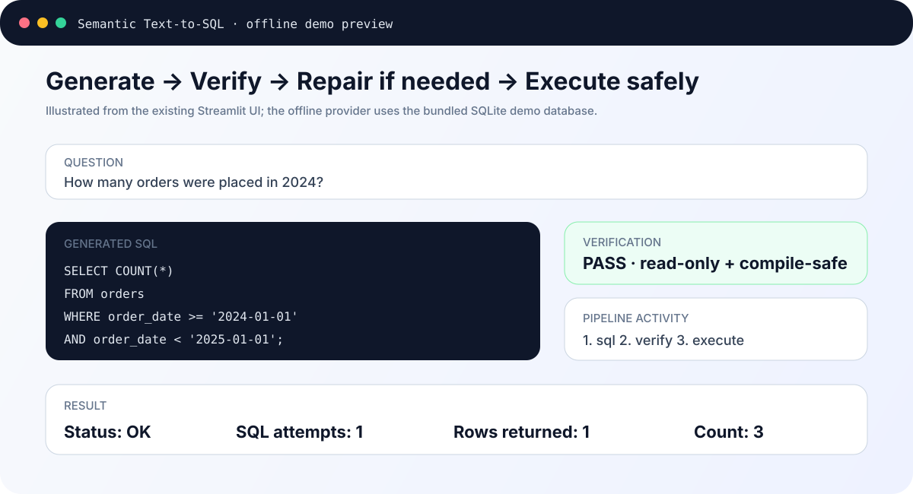
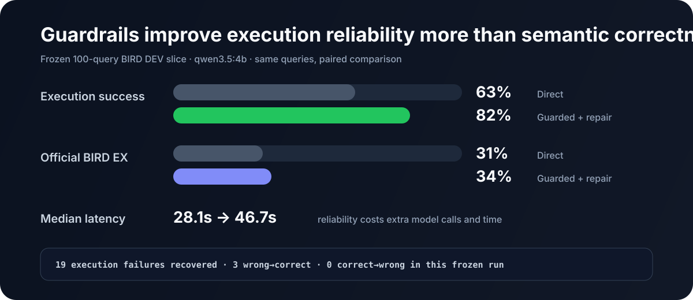
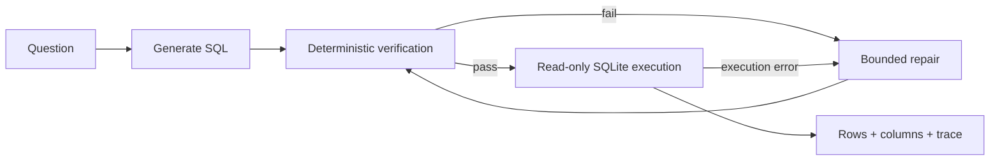

<h1 align="center">Semantic Text-to-SQL</h1>

<p align="center">
  <strong>Local NL → SQL with deterministic verification, bounded repair, and read-only execution.</strong>
</p>

<p align="center">
  
  
  
  
  
</p>

> [!NOTE]
> The point of this project is not just to generate SQL. It makes the **reliability layer around the model visible and measurable**.

## Demo

```cmd
run-demo.cmd
```

The Streamlit demo puts the whole path on one screen, and the default **Demo (offline)** provider needs no Ollama or API key.

<p align="center">
  
</p>

> The image above is an illustrated preview of the existing Streamlit UI, not a benchmark screenshot.

```text
Question
  ↓
Generate SQL
  ↓
Verify ✓ ── failure ──→ Repair (max 2)
  ↓                         │
Execute read-only ←─────────┘
  ↓
Result table + trace
```

Try:

```text
How many orders were placed in 2024?
```

The built-in offline provider demonstrates the same service flow without Ollama. It exists for the product demo only; benchmark claims below come from the frozen local-model run.

## Measured result

Frozen paired evaluation on **100 BIRD DEV queries** using local `qwen3.5:4b` through Ollama:

<p align="center">
  
</p>

| Metric | Direct | Guarded + repair |
|---|---:|---:|
| Execution success | 63% | **82%** |
| Official BIRD EX | 31% | **34%** |
| Median latency | **28.1 s** | 46.7 s |

The guarded path recovered **19 direct execution failures**. It improves execution reliability, but costs latency and does **not** guarantee semantic correctness.

Source of truth: [`runs/bird-paired-dev-v4/paired.json`](runs/bird-paired-dev-v4/paired.json).

## Two failures worth inspecting

The aggregate numbers hide the most important engineering lesson: **a query becoming executable is not the same thing as becoming correct**.

### 1. Repair can recover execution without recovering meaning

**BIRD case 430 · `card_games`**

The direct query referenced a nonexistent `cardKingdoms` table and failed to execute. The guarded path caught the compile failure, repaired the SQL once, passed verification, and executed successfully — but the final query still failed official BIRD EX.

```text
Direct
  → execution failed: no such table: cardKingdoms

Guarded
  → verify: sqlite_compile_error
  → repair attempt 1
  → verify: PASS
  → execute: rows=0
  → official EX: false
```

**Takeaway:** bounded repair is useful for operational reliability, but a successful execution is not evidence that the model understood the question.

### 2. Some wrong answers look completely healthy

**BIRD case 1366 · `student_club`**

For “List all the members who attended the event `October Meeting`,” the generated SQL passed deterministic verification and returned 23 rows. Both direct and guarded paths executed successfully, yet official BIRD EX was false.

```text
verify: PASS
execute: rows=23
status: OK
official EX: false
```

**Takeaway:** deterministic checks can reject unsafe or invalid SQL; they cannot prove semantic correctness. That needs task-level evaluation.

Both examples come from the same frozen paired run used for the headline metrics above.

## Architecture



## Engineering choices

- **Deterministic checks before execution** instead of asking another model to judge obvious failures.
- **Read-only SQLite execution** so generated SQL cannot mutate the database.
- **Bounded repair** with `max_repairs=2`, avoiding an open-ended agent loop.
- **One service layer** behind Streamlit, FastAPI, and CLI.
- **Paired evaluation** on the same frozen BIRD cases.
- **Separate reliability from correctness**: execution success and official EX are reported independently.

## Quickstart

### Offline visual demo

```bash
uv sync
uv run streamlit run app.py
```

The default offline mode uses the bundled SQLite demo database and requires no model download or API key, which also makes the repository ready for a lightweight Streamlit Community Cloud deployment.

### Local-model path

```bash
ollama pull qwen3.5:4b
uv run streamlit run app.py
```

Choose **Ollama** in the sidebar.

### CLI

```bash
uv run semantic-sql ask "Which customer spent the most?"
```

### FastAPI

```bash
uv run uvicorn semantic_sql.api:app --reload
```

## Evaluation note

> [!IMPORTANT]
> **Execution success is not Text-to-SQL accuracy.** A query can execute successfully and still answer the wrong question. The 82% figure therefore represents execution reliability, while official BIRD EX is the correctness-oriented metric.

## Limits

- Frozen 100-query BIRD DEV sample, not the full benchmark.
- SQLite only in the current implementation.
- Results depend on the frozen local-model configuration.
- The offline provider is demo infrastructure, not evaluation evidence.
